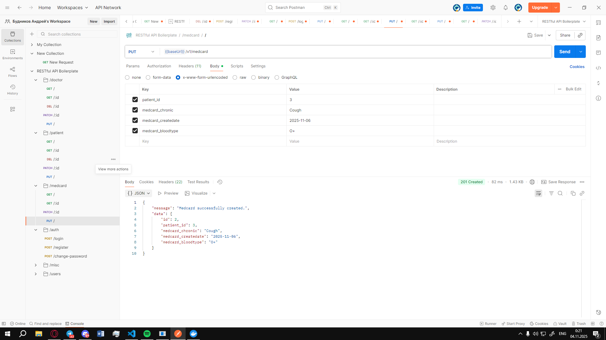
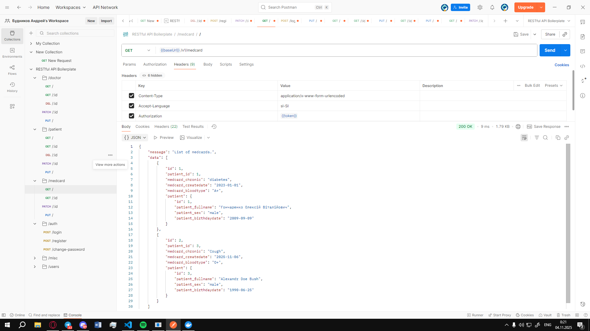
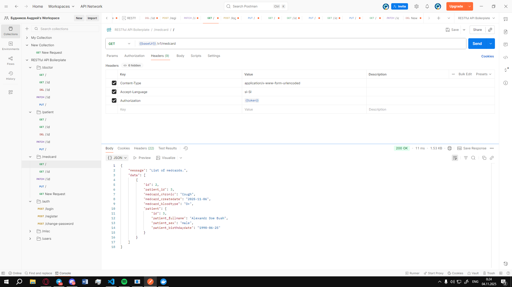

# Документація сутностей та API

##  Реалізовані сутності

### Doctor
- **Поля:**
  - `id` — первинний ключ
  - `specialty_id` — зовнішній ключ → `specialty.id`
  - `doctor_fullname` — ПІБ лікаря (унікальне, max 40 символів)
  - `doctor_number` — код лікаря (унікальне, max 10 символів, nullable)
  - `doctor_office` — номер кабінету (1–999, перевірка через `@Check`)
  - `doctor_workschedule` — графік роботи (nullable, max 100 символів)
- **Зв’язки:**
  - `ManyToOne` → `Specialty`

---

### Medcard
- **Поля:**
  - `id` — первинний ключ
  - `patient_id` — зовнішній ключ → `patient.id`
  - `medcard_chronic` — хронічні захворювання (nullable, max 50 символів)
  - `medcard_createdate` — дата створення картки
  - `medcard_bloodtype` — група крові (varchar(3), default: `O-`)
  - `created_at`, `updated_at` — системні дати
- **Зв’язки:**
  - `ManyToOne` → `Patient` (каскадне видалення/оновлення)

---

### Patient
- **Поля:**
  - `id` — первинний ключ
  - `patient_fullname` — ПІБ пацієнта (унікальне, max 40 символів)
  - `patient_sex` — стать (varchar(10), default: `other`)
  - `patient_address` — адреса (nullable, max 30 символів)
  - `patient_registerdate` — дата реєстрації
  - `patient_number` — номер пацієнта (унікальне, nullable, max 20 символів)
  - `patient_birthdaydate` — дата народження
  - `created_at`, `updated_at` — системні дати
- **Зв’язки:**
  - `OneToMany` → `Medcard`

---

### Specialty
- **Поля:**
  - `id` — первинний ключ
  - `specialty_name` — назва спеціальності (varchar(30))
  - `specialty_salary` — зарплата (numeric, 8000–25000, перевірка через `@Check`)
- **Зв’язки:**
  - `OneToMany` → `Doctor`

---

##  Зв’язки між сутностями
- **Doctor → Specialty**: багато лікарів належать до однієї спеціальності.
- **Medcard → Patient**: багато медкарт належать одному пацієнту.
- **Patient → Medcard**: пацієнт має список медкарт.
- **Doctor → Medcard**: лікар може бути прив’язаний до медкарти (через `doctor_id`, якщо додати).

---

##  Реалізовані API ендпоінти

### Doctor API
- `GET /doctor` — отримати список лікарів
- `GET /doctor/{id}` — отримати лікаря за ID
- `POST /doctor` — створити лікаря
- `PUT /doctor/{id}` — оновити дані лікаря
- `DELETE /doctor/{id}` — видалити лікаря

### Patient API
- `GET /patient` — отримати список пацієнтів
- `GET /patient/{id}` — отримати пацієнта за ID
- `POST /patient` — створити пацієнта
- `PUT /patient/{id}` — оновити дані пацієнта
- `DELETE /patient/{id}` — видалити пацієнта

### Medcard API
- `GET /medcard` — отримати список медкарт
- `GET /medcard/{id}` — отримати медкарту за ID
- `POST /medcard` — створити медкарту
- `PUT /medcard/{id}` — оновити медкарту
- `DELETE /medcard/{id}` — видалити медкарту

### Specialty API
- `GET /specialty` — отримати список спеціальностей
- `GET /specialty/{id}` — отримати спеціальність за ID
- `POST /specialty` — створити спеціальність
- `PUT /specialty/{id}` — оновити спеціальність
- `DELETE /specialty/{id}` — видалити

# POST-запити
## Ліст лікарів

## Створення медкартки

## Ліст медкарт

## Видалення медкартки

## Після видалення

## Оновлення пацієнту


# Архітектура шарів у бекенді

## 🛡️ Middleware (валідація)
- **Роль:** перехоплює HTTP‑запит ще до контролера.
- **Задачі:**
  - Перевірка заголовків (`Content-Type`, токен авторизації).
  - Валідація тіла запиту (чи всі потрібні поля, чи правильний формат).
  - Логування, обробка помилок, фільтрація.
- **Приклад:** якщо у `POST /doctor` немає `doctor_fullname`, middleware повертає `400 Bad Request`.

---

## 🎯 Controller (оркестрація)
- **Роль:** точка входу для ендпоінта.
- **Задачі:**
  - Отримати дані з `req.body`, `req.params`, `req.query`.
  - Викликати відповідний сервіс.
  - Сформувати відповідь (JSON, статус код).

---

## ⚙️ Service (бізнес‑логіка)
- **Роль:** реалізація правил предметної області.
- **Задачі:**
  - Перевірка бізнес‑правил (наприклад, унікальність `doctor_number`).
  - Виклик репозиторіїв для роботи з даними.
  - Комбінування кількох операцій (створення лікаря + графік роботи).

---

## 💾 Repository (доступ до даних)
- **Роль:** шар для роботи з базою даних.
- **Задачі:**
  - Виконання CRUD‑операцій (`find`, `save`, `update`, `delete`).
  - Інкапсуляція SQL/ORM запитів.
  - Повернення сутностей у вигляді об’єктів.
 
# Приклад middleware
  
```javascript
  export const validatorMedcardCreate = async (req: Request, res: Response, next: NextFunction) => {
  let { 
    patient_id,
    medcard_chronic, 
    medcard_createdate,
    medcard_bloodtype
  } = req.body;
  
  const errorsValidation: ErrorValidation[] = [];

  // Преобразование и тримминг
  patient_id = !patient_id ? '' : patient_id.toString().trim();
  medcard_chronic = !medcard_chronic ? '' : medcard_chronic.toString().trim();
  medcard_createdate = !medcard_createdate ? '' : medcard_createdate.toString();
  medcard_bloodtype = !medcard_bloodtype ? '' : medcard_bloodtype.toString().trim();

  // Валидация patient_id
  if (validator.isEmpty(patient_id)) {
    errorsValidation.push({ patient_id: 'Patient ID is required' });
  } else if (!validator.isInt(patient_id, { min: 1 })) {
    errorsValidation.push({ patient_id: 'Patient ID must be a positive integer' });
  } else {
    // Проверка что пациент существует
    try {
      const patientRepository = getRepository(Patient);
      const patient = await patientRepository.findOne(parseInt(patient_id));
      if (!patient) {
        errorsValidation.push({ patient_id: `Patient with ID ${patient_id} not found` });
      }
    } catch (error) {
      errorsValidation.push({ patient_id: 'Invalid patient ID' });
    }
  }

  // Валидация medcard_chronic (опционально)
  if (medcard_chronic && !validator.isLength(medcard_chronic, { min: 0, max: 50 })) {
    errorsValidation.push({ medcard_chronic: 'Chronic disease must be maximum 50 characters' });
  }

  // Валидация medcard_createdate
  if (validator.isEmpty(medcard_createdate)) {
    errorsValidation.push({ medcard_createdate: 'Medcard create date is required' });
  } else if (!validator.isDate(medcard_createdate)) {
    errorsValidation.push({ medcard_createdate: 'Medcard create date must be a valid date' });
  }

  // Валидация medcard_bloodtype
  if (validator.isEmpty(medcard_bloodtype)) {
    errorsValidation.push({ medcard_bloodtype: 'Blood type is required' });
  } else {
    const validBloodTypes = ['O-', 'O+', 'A-', 'A+', 'B-', 'B+', 'AB-', 'AB+'];
    if (!validBloodTypes.includes(medcard_bloodtype)) {
      errorsValidation.push({ 
        medcard_bloodtype: `Blood type must be one of: ${validBloodTypes.join(', ')}` 
      });
    }
  }

  // Проверка что у пациента еще нет медкарты
  if (patient_id && validator.isInt(patient_id, { min: 1 })) {
    try {
      const medcardRepository = getRepository(Medcard);
      const existingMedcard = await medcardRepository.findOne({
        where: { patient_id: parseInt(patient_id) },
      });
      
      if (existingMedcard) {
        errorsValidation.push({ patient_id: `Patient with ID ${patient_id} already has a medcard` });
      }
    } catch (error) {
      // Игнорируем ошибки поиска при валидации
    }
  }

  if (errorsValidation.length !== 0) {
    const customError = new CustomError(
      400, 
      'Validation', 
      'Create medcard validation error', 
      null, 
      null, 
      errorsValidation
    );
    return next(customError);
  }
  
  return next();
};
```
# Приклад responseDTO
```javascript
export class PatientResponseDto {
    id: number;
    patient_fullname: string;
    patient_sex: string;
    patient_registerdate: Date;
    patient_birthdaydate: Date;

    constructor(patient: Patient) {
        this.id = patient.id;
        this.patient_fullname = patient.patient_fullname;
        this.patient_sex = patient.patient_sex;
        this.patient_registerdate = patient.patient_registerdate;
        this.patient_birthdaydate = patient.patient_birthdaydate;
    }
}
```
# Скріншоти з POSTMAN

