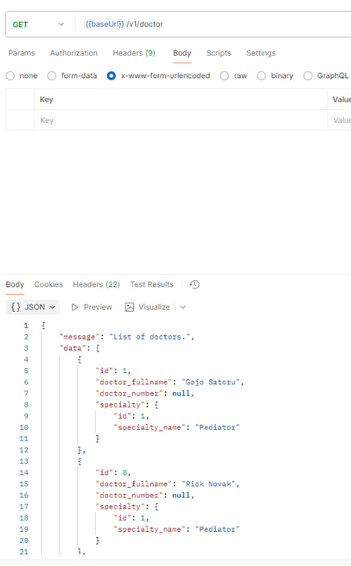
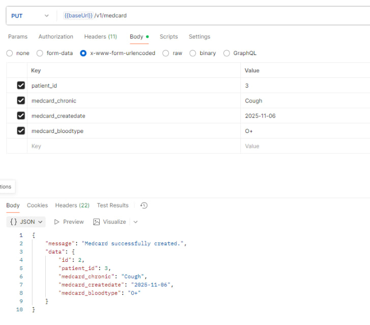
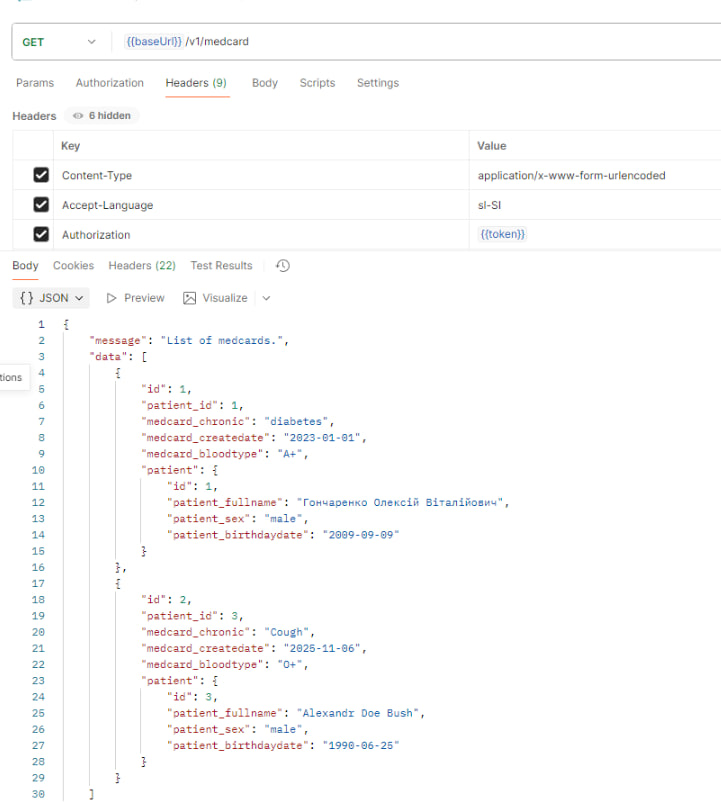
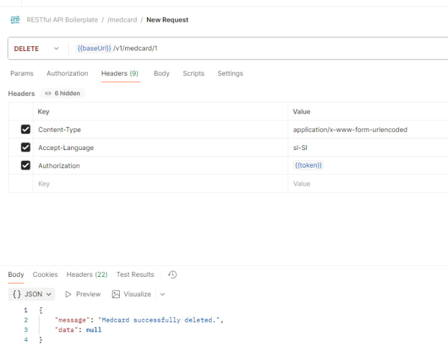
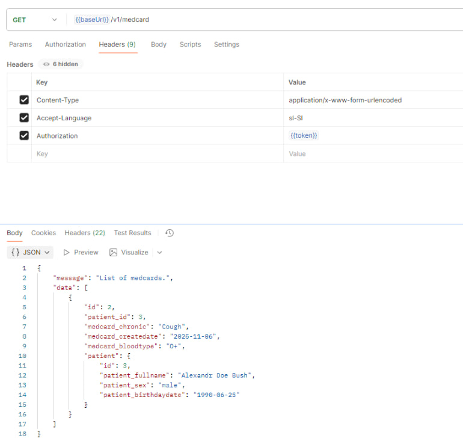
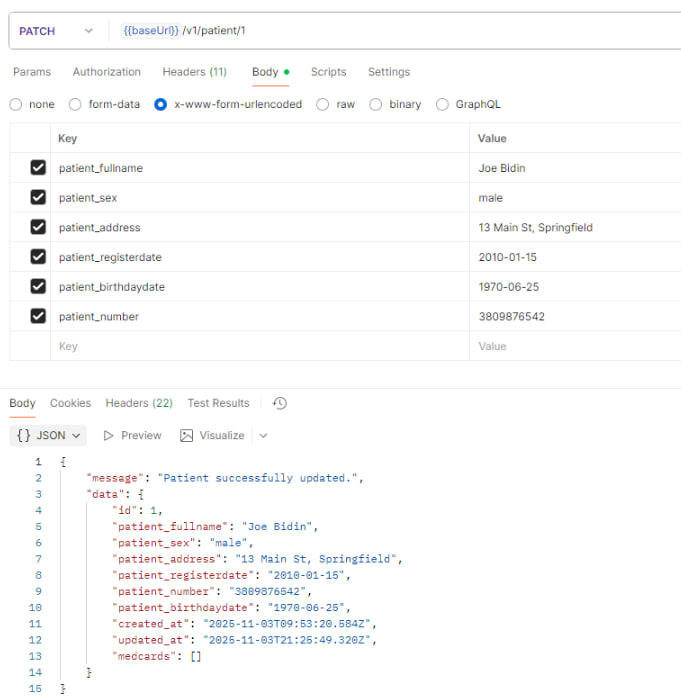

# Медична система

## 📋 Сутності та зв'язки

### 1. **Patient (Пацієнт)**

**Атрибути:**
- `id` - унікальний ідентифікатор
- `patient_fullname` - ПІБ пацієнта (40 символів, унікальний)
- `patient_sex` - стать ('male', 'female', 'other')
- `patient_address` - адреса (30 символів, опціонально)
- `patient_registerdate` - дата реєстрації
- `patient_number` - номер телефону (20 символів, унікальний, опціонально)
- `patient_birthdaydate` - дата народження

**Зв'язок:** `One-to-Many` з Medcard

### 2. **Medcard (Медична карта)**

**Атрибути:**
- `id` - унікальний ідентифікатор
- `patient_id` - зовнішній ключ до Patient
- `medcard_chronic` - хронічні захворювання (50 символів, опціонально)
- `medcard_createdate` - дата створення картки
- `medcard_bloodtype` - група крові ('O-', 'O+', 'A-', 'A+', 'B-', 'B+', 'AB-', 'AB+')

**Зв'язок:** `Many-to-One` з Patient

### 3. **Doctor (Лікар)**

**Атрибути:**
- `id` - унікальний ідентифікатор
- `doctor_fullname` - ПІБ лікаря
- `doctor_number` - номер телефону
- `specialty_id` - зовнішній ключ до Specialty

### 4. **Specialty (Спеціальність)**

**Атрибути:**
- `id` - унікальний ідентифікатор  
- `specialty_name` - назва спеціальності

**Зв'язок:** `One-to-Many` з Doctor

## 🌐 API Ендпоінти

### **Пацієнти (Patients)**

- `GET /patients` - отримати список пацієнтів
- `GET /patients/:id` - отримати пацієнта по ID
- `POST /patients` - створити нового пацієнта
- `PUT /patients/:id` - оновити пацієнта
- `PATCH /patients/:id` - частково оновити пацієнта
- `DELETE /patients/:id` - видалити пацієнта

### **Медичні карти (Medcards)**

- `GET /medcards` - отримати список медкарт
- `GET /medcards/:id` - отримати медкарту по ID (з даними пацієнта)
- `POST /medcards` - створити нову медкарту
- `PUT /medcards/:id` - оновити медкарту
- `PATCH /medcards/:id` - частково оновити медкарту  
- `DELETE /medcards/:id` - видалити медкарту

### **Лікарі (Doctors)**

- `GET /doctors` - отримати список лікарів
- `GET /doctors/:id` - отримати лікаря по ID
- `POST /doctors` - створити нового лікаря
- `PUT /doctors/:id` - оновити лікаря
- `PATCH /doctors/:id` - частково оновити лікаря
- `DELETE /doctors/:id` - видалити лікаря

### **Аутентифікація (Auth)**

- `POST /login` - вхід в систему
- `POST /register` - реєстрація
- `POST /change-password` - зміна пароля

## **Скріншоти с постман**

 

